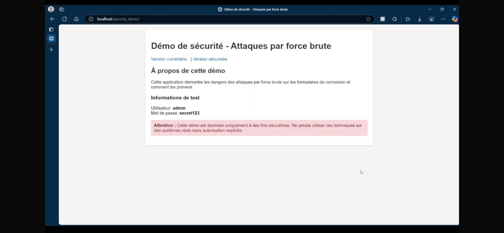
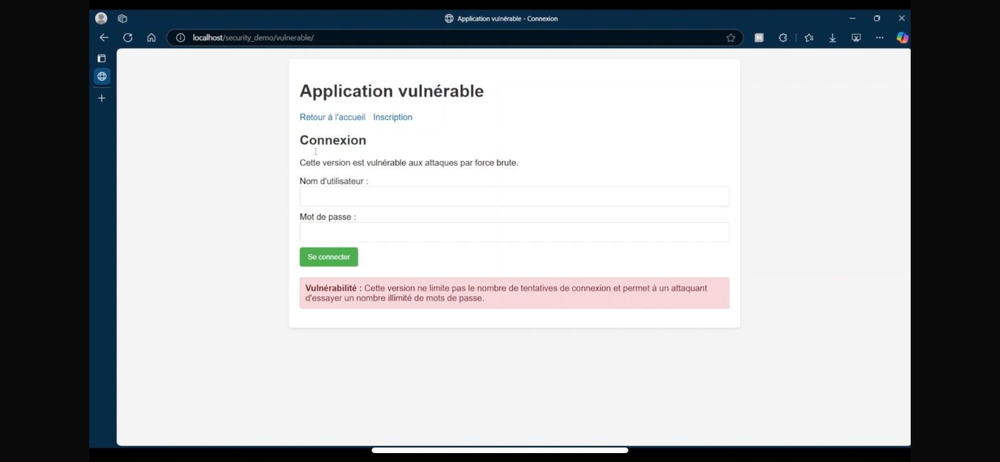
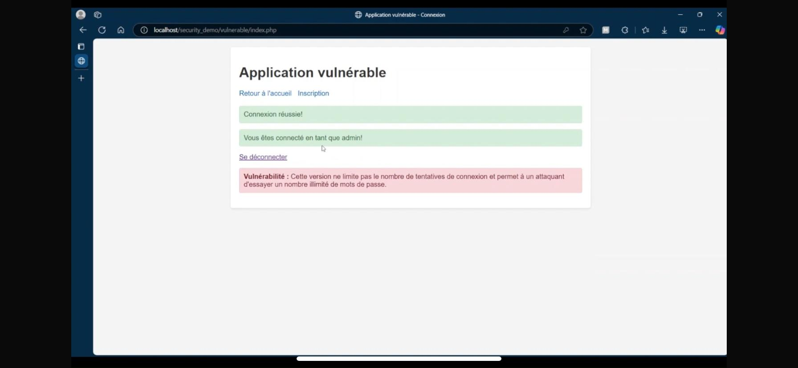
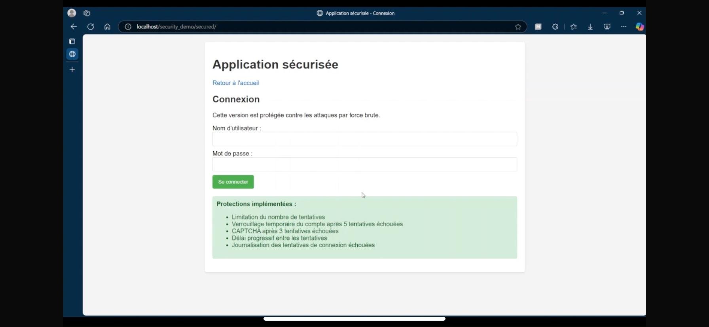
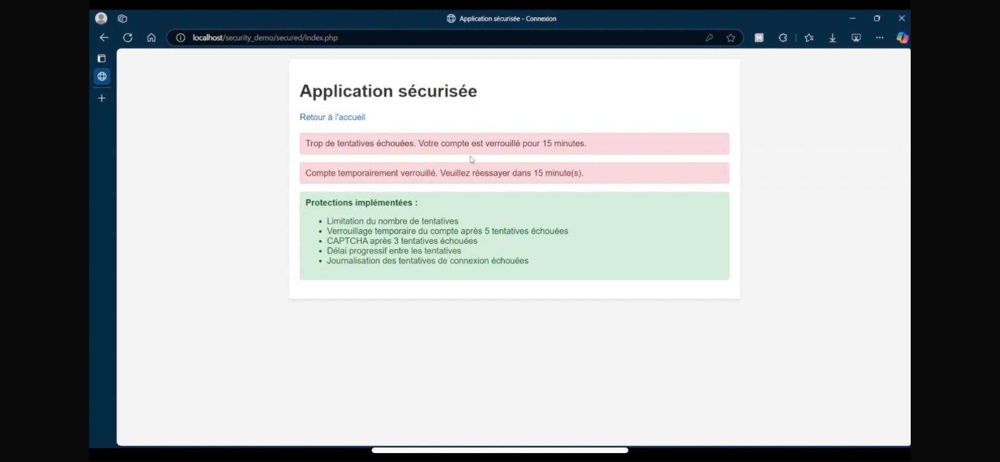
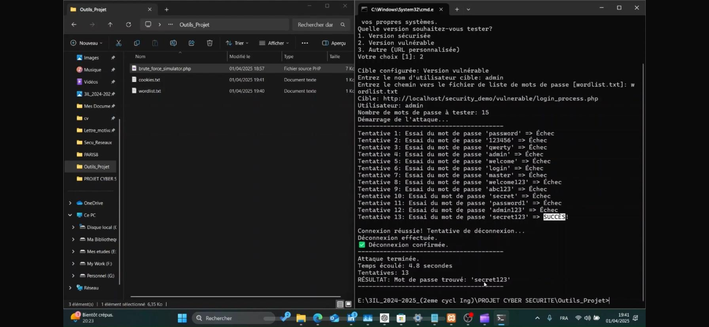

# Security_Demo

**Security_Demo** est un site web éducatif développé avec **PHP, HTML, CSS et MySQL**, qui explique l'attaque par force brute à travers une simulation réaliste.  
Il montre comment se protéger contre ce type d'attaque avec des techniques comme :

- Limitation des tentatives de connexion
- CAPTCHA
- Renforcement des mots de passe

## 🎯 Objectif

Sensibiliser les développeurs et les utilisateurs aux risques de l'attaque brute force et proposer des bonnes pratiques pour s’en défendre.

## 🛠️ Technologies utilisées

- PHP
- HTML / CSS
- MySQL

## 📷 Captures d'écran

### 🏠 Interface d'accueil


---

### 🔓 Formulaire vulnérable


---

### ✅ Accès à la page vulnérable après brute force


---

### 🔐 Formulaire sécurisé


---

### ❌ Échec d'authentification sur le formulaire sécurisé


---

### 🧪 Test du script d'attaque brute force



```md
